### 1. **Flowers**

(a) Rename the column names and recode the levels of categorical variables to descriptive names. For example, "V1" should be renamed "winters" and the levels to "no" or "yes". Display the full dataset.


```r
library(tidyverse)
library(cluster)
colnames(flower)
```

```
## [1] "V1" "V2" "V3" "V4" "V5" "V6" "V7" "V8"
```

```r
colnames(flower) <- c('winters', 'shadow', 'tubers', 'color',
                      'soil', 'preference', 'height', 'distance')
flower$winters <- as.character(flower$winters)
flower$winters[flower$winters == 0] <- 'no'
flower$winters[flower$winters == 1] <- 'yes'
flower$shadow <- as.character(flower$shadow)
flower$shadow[flower$shadow == 0] <- 'no'
flower$shadow[flower$shadow == 1] <- 'yes'
flower$tubers <- as.character(flower$tubers)
flower$tubers[flower$tubers == 0] <- 'no'
flower$tubers[flower$tubers == 1] <- 'yes'
flower$color <- as.character(flower$color)
flower$color <- recode(flower$color, '1' = 'white', '2' = 'yellow', '3' = 'pink', '4' = 'red', '5' = 'blue')
flower$soil <- as.character(flower$soil)
flower$soil <- recode(flower$soil, '1' = 'dry', '2' = 'normal', '3' = 'wet')
flower
```

```
##    winters shadow tubers  color   soil preference height distance
## 1       no    yes    yes    red    wet         15     25       15
## 2      yes     no     no yellow    dry          3    150       50
## 3       no    yes     no   pink    wet          1    150       50
## 4       no     no    yes    red normal         16    125       50
## 5       no    yes     no   blue normal          2     20       15
## 6       no    yes     no    red    wet         12     50       40
## 7       no     no     no    red    wet         13     40       20
## 8       no     no    yes yellow normal          7    100       15
## 9      yes    yes     no   pink    dry          4     25       15
## 10     yes    yes     no   blue normal         14    100       60
## 11     yes    yes    yes   blue    wet          8     45       10
## 12     yes    yes    yes  white normal          9     90       25
## 13     yes    yes     no  white normal          6     20       10
## 14     yes    yes    yes    red normal         11     80       30
## 15     yes     no     no   pink normal         10     40       20
## 16     yes     no     no    red normal         18    200       60
## 17     yes     no     no yellow normal         17    150       60
## 18      no     no    yes yellow    dry          5     25       10
```

(b) Create frequency bar charts for the `color` and `soil` variables, using best practices for the order of the bars.


```r
flower$color <- as.factor(flower$color)
flower %>%
  ggplot(aes(x = reorder(color, color, function(x)-length(x)))) + 
  geom_bar(aes(fill = color), color = '#000000') +
  scale_fill_manual(values = c('#0000FF', '#FF00FF', '#FF0000', '#FFFFFF', '#FFFF00')) +
  xlab('color') +
  ggtitle('flower color')
```

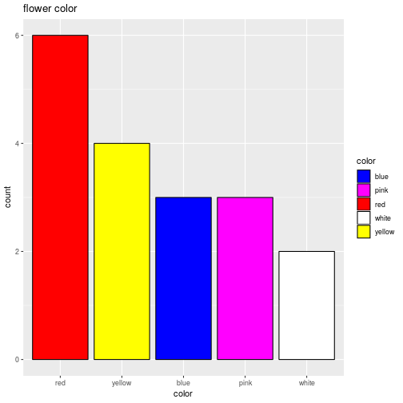

```r
flower$soil <- as.factor(flower$soil)
flower %>% 
  ggplot(aes(x = reorder(soil, soil, function(x)-length(x)))) +
  geom_bar(aes(fill = soil)) +
  scale_fill_brewer() +
  theme_dark() +
  xlab('soil') +
  ggtitle('flower soil saturation')
```

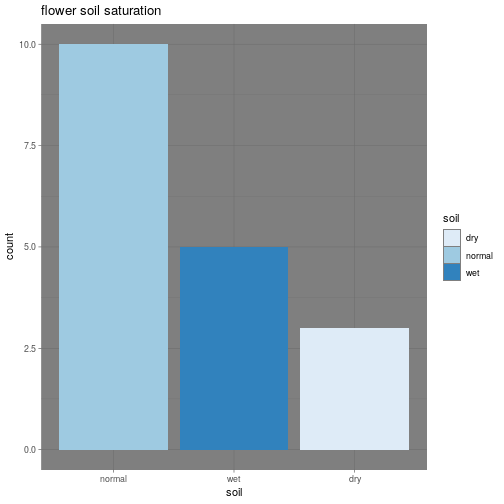

### 2. Minneapolis

Data: `MplsDemo` dataset in **carData** package

(a) Create a Cleveland dot plot showing estimated median household income by neighborhood.

```r
library(carData)
MplsDemo %>% 
  ggplot(aes(x = reorder(neighborhood, hhIncome), y = hhIncome)) +
  geom_point(color = 'blue') +
  coord_flip() +
  ggtitle('Median household income') +
  xlab('neightborhood') +
  theme_bw() +
  theme(axis.text.y = element_text(size = rel(.75)),
        panel.grid.major.y = element_line(size = 1.0),
        panel.grid.major.x = element_blank(),
        panel.grid.minor.x = element_blank())
```

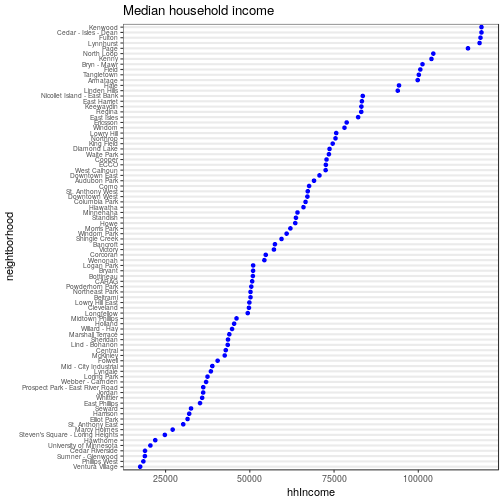

(b) Create a Cleveland dot plot to show percentage of foreign born, earning less than twice the poverty level, and with a college degree in different colors.  Data should be sorted by college degree.


```r
MplsDemo %>% 
  mutate(foreignBornP = foreignBorn * 100,
         povertyP = poverty * 100,
         collegeGradP = collegeGrad * 100) %>% 
  ggplot() +
  geom_point(aes(x = foreignBornP, 
                 y = reorder(neighborhood, collegeGradP),
                 color = 'Foreign Born'), alpha = .75) +
  geom_point(aes(x = povertyP,
                 y = reorder(neighborhood, collegeGradP),
                 color = 'Poverty'), alpha = .75) +
  geom_point(aes(x = collegeGradP,
                 y = reorder(neighborhood, collegeGradP), 
                 color = 'College Graduation'), alpha = .75) +
  ylab('neighborhood') +
  xlab('percentage of population') +
  ggtitle('Minneapolis demographics') +
  theme_dark() +
  theme(axis.text.y = element_text(size = rel(.75))) +
  scale_color_manual(values = c('#fc8d59',
                                '#ffffbf',
                                '#91bfdb'))
```

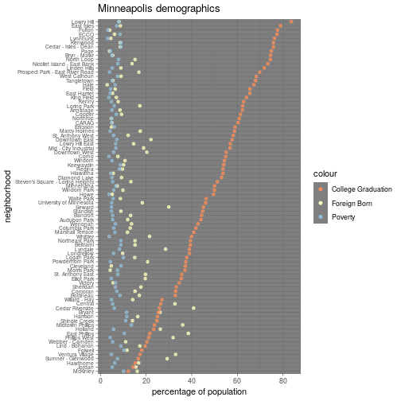

(c) What patterns do you observe? What neighborhoods do not appear to follow these patterns?  

From this graph it seems like as college graduation rate increases there are fewer foreign born and impoverished residents. The correlation is broken by a number of neighborhhods: Downtown East and West, Loring Park and Prospect Park are among those with high college graduation and many foreign born residents. Although there also seems to be a correlation between a greater share of foreign born and greater poverty this is broken in Cedar Riverside, Seward, Marcy Holmes and Ventura Village.  
To get a better grasp on any relationships I tried reordering the plot by foreignBorn and poverty:


```r
MplsDemo %>% 
  mutate(foreignBornP = foreignBorn * 100,
         povertyP = poverty * 100,
         collegeGradP = collegeGrad * 100) %>% 
  ggplot() +
  geom_point(aes(x = foreignBornP, 
                 y = reorder(neighborhood, foreignBornP),
                 color = 'Foreign Born'), alpha = .75) +
  geom_point(aes(x = povertyP,
                 y = reorder(neighborhood, foreignBornP),
                 color = 'Poverty'), alpha = .75) +
  geom_point(aes(x = collegeGradP,
                 y = reorder(neighborhood, foreignBornP), 
                 color = 'College Graduation'), alpha = .75) +
  ylab('neighborhood') +
  xlab('percentage of population') +
  ggtitle('Minneapolis demographics (by foreignBorn)') +
  theme_dark() +
  theme(axis.text.y = element_text(size = rel(.75))) +
  scale_color_manual(values = c('#fc8d59',
                                '#ffffbf',
                                '#91bfdb'))
```

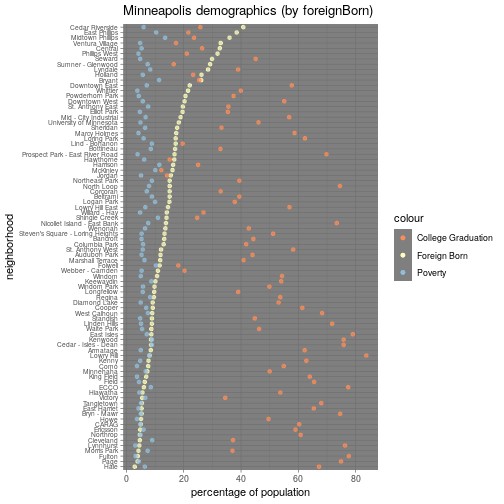

```r
MplsDemo %>% 
  mutate(foreignBornP = foreignBorn * 100,
         povertyP = poverty * 100,
         collegeGradP = collegeGrad * 100) %>% 
  ggplot() +
  geom_point(aes(x = foreignBornP, 
                 y = reorder(neighborhood, povertyP),
                 color = 'Foreign Born'), alpha = .75) +
  geom_point(aes(x = povertyP,
                 y = reorder(neighborhood, povertyP),
                 color = 'Poverty'), alpha = .75) +
  geom_point(aes(x = collegeGradP,
                 y = reorder(neighborhood, povertyP), 
                 color = 'College Graduation'), alpha = .75) +
  ylab('neighborhood') +
  xlab('percentage of population') +
  ggtitle('Minneapolis demographics (by poverty)') +
  theme_dark() +
  theme(axis.text.y = element_text(size = rel(.75))) +
  scale_color_manual(values = c('#fc8d59',
                                '#ffffbf',
                                '#91bfdb'))
```

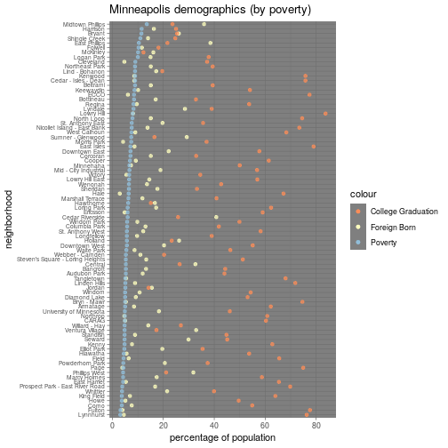

Ordering by foreignBorn yields a negative correlation with college graduation and a positive with poverty, but I think that the relationship is more tenuous than what the first graph led me to believe.  
Ordering by poverty does not give me the impression of any relationship with either foreignBorn or college graduation, there is so much variation in both.


```r
mod1 <- lm(collegeGrad~foreignBorn, data = MplsDemo)
coef(mod1)
```

```
## (Intercept) foreignBorn 
##   0.6608278  -1.3073345
```

```r
mod2 <- lm(collegeGrad~poverty, data = MplsDemo)
coef(mod2)
```

```
## (Intercept)     poverty 
##   0.6559692  -2.7782848
```

There were negative relationships between college graduation and the foreignBorn and poverty features of the data, but maybe not as strong as the initial plot, or these linear regressions, suggests.

### 3. Taxis

Data: NYC yellow cab rides in June 2018, available here:  

http://www.nyc.gov/html/tlc/html/about/trip_record_data.shtml

It's a large file so work with a reasonably-sized random subset of the data.

Draw four scatterplots of `tip_amount` vs. `far_amount` with the following variations:

(a) Points with alpha blending


```r
colnames(yellow_subset2) <- c('id', 'pickup', 'dropoff',
                             'passenger', 'dist', 'pu', 'do',
                             'ratecode', 'store', 'payment',
                             'fare_amount', 'extra', 'mta',
                             'imp', 'tip_amount', 'tolls', 'total')
```

```
## Error in colnames(yellow_subset2) <- c("id", "pickup", "dropoff", "passenger", : object 'yellow_subset2' not found
```

```r
yellow_subset %>%
  ggplot(mapping = aes(tip_amount, fare_amount)) +
  geom_point(alpha = .25) +
  xlab('Tip') + ylab('Fare') +
  ggtitle('NYC Taxi Cabs, June 2018')
```


(b) Points with alpha blending + density estimate contour lines


```r
yellow_subset %>%
  ggplot(mapping = aes(tip_amount, fare_amount)) +
  geom_point(alpha = .25) +
  geom_density_2d(color = 'blue') +
  xlab('Tip') + ylab('Fare') +
  ggtitle('NYC Taxi Cabs, June 2018') +
  xlim(c(6, 20))
```

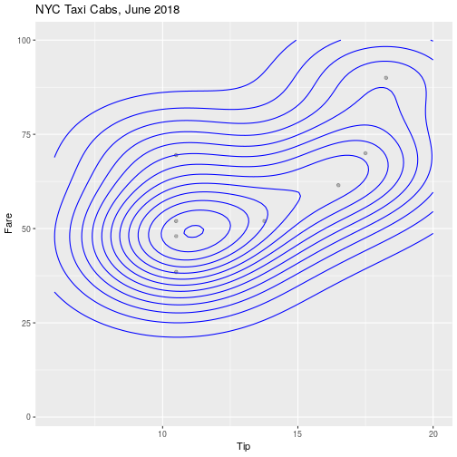

(c) Hexagonal heatmap of bin counts


```r
yellow_subset %>%
  ggplot(mapping = aes(tip_amount, fare_amount)) +
  geom_hex(bins = 25) +
  xlab('Tip') + ylab('Fare') +
  ggtitle('NYC Taxi Cabs, June 2018') +
  xlim(c(-1, 13)) + ylim(c(0, 50)) +
  scale_fill_gradient(low = '#a1d99b', high = '#00441b')
```

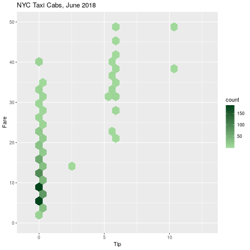

(d) Square heatmap of bin counts 


```r
yellow_subset %>%
  ggplot(mapping = aes(tip_amount, fare_amount)) +
  geom_bin2d(bins = 20) +
  xlab('Tip') + ylab('Fare') +
  ggtitle('NYC Taxi Cabs, June 2018') +
  xlim(c(-1, 15)) + ylim(c(0, 60)) +
  scale_fill_gradient(low = '#a1d99b', high = '#00441b')
```

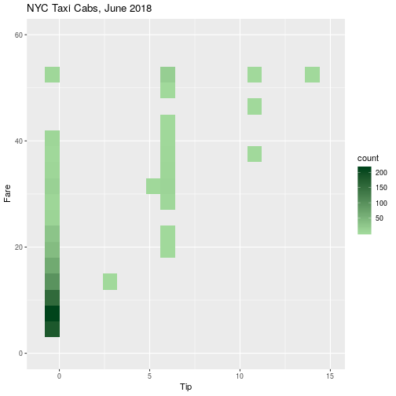

For all, adjust parameters to the levels that provide the best views of the data.

(e) Describe noteworthy features of the data, using the "Movie ratings" example on page 82 (last page of Section 5.3) as a guide.  

From the two scatter plots we can see that there were many rides with a low fare, < 20, and no tip. There were also many low fare rides with a low tip and where the tip was the same amount, about $6. This is discernible from the dark vertical lines in the first plot and the high counts of the two heatmaps for low fare and low tip. From the first plot we can see a few outlier rides, with very high fare and zero tip or with high fare and tip. There were no rides with a low fare and a very high tip and many, but not all, of the high fare rides also had a large tip. Most rides are for a low fare and little to no tip. In the density plot of high tip rides we see a bit of a concentration at the $10 tip amount and a linear relationship between tip and fare. This linear relationship is evident in the heatmaps as well, but with strong concentrations at the tip amounts of zero and six for a wide range of fares.

### 4. Olive Oil

Data: `olives` dataset in **extracat** package

(a) Draw a scatterplot matrix of the eight continuous variables. Which pairs of variables are strongly positively associated and which are strongly negatively associated?


```r
library(extracat)
pairs(olives[,3:10], pch=21)
```

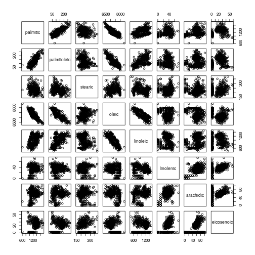

The strongly positively associated variables are: palmitic ~ palmitoleic, palmitoleic ~ linoleic. The stronly negatively associated variables are: palmitic ~ oleic, palmitoleic ~ oleic, oleic ~ linoleic.

(b) Color the points by region.  What do you observe?


```r
olives %>% 
  group_by(Region) %>%
  summarise(n())
```

```
## # A tibble: 3 x 2
##   Region   `n()`
##   <fct>    <int>
## 1 North      151
## 2 Sardinia    98
## 3 South      323
```

```r
my_cols <- c('#66c2a5', '#fc8d62', '#8da0cb')
pairs(olives[,3:10], pch=21, col = my_cols[olives$Region],
      lower.panel = NULL)
legend("bottomleft",
       fill = unique(my_cols[olives$Region]),
       legend = c(levels(olives$Region)))
```

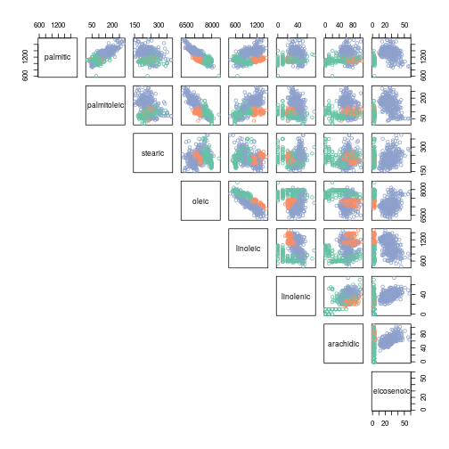

Olives from the North generally have higher amounts of each of the fatty acids. In particular olives from the North apparently have universally greater levels of elcosenoic, while Sardinian and Southern olives have almost none. There may be something going on with the measurements for Southern olives because the amounts of linolenic and arachidic fatty acids look like they have been rounded, particularly for low amounts but also for some higher amounts. Southern and Sardinian olives have very similar levels of palmitic and palmitoleic fatty acids. Southern olives have more oleic than Sardinian but the reverse holds for linoleic.

### 5. Wine

Data: `wine` dataset in **pgmm** package

(Recode the `Type` variable to descriptive names.)

(a) Use parallel coordinate plots to explore how the variables separate the wines by `Type`. Present the version that you find to be most informative. You do not need to include all of the variables.


```r
library(pgmm)
data(wine)
library(plotly)
p <- wine %>% 
  plot_ly(type = 'parcoords',
             line = list(color = ~ Type),
             dimensions = list(
               list(range = c(min(wine$Alcohol), max(wine$Alcohol)),
                    label = 'Alchohol',
                    values = ~ Alcohol),
               list(range = c(min(wine$`Sugar-free Extract`), max(wine$`Sugar-free Extract`)),
                    label = 'Sugar-free Extract',
                    values = ~`Sugar-free Extract`),
               list(range = c(min(wine$`Fixed Acidity`), max(wine$`Fixed Acidity`)),
                    label = 'Fixed Acidity',
                    values = ~`Fixed Acidity`),
               list(range = c(min(wine$`Tartaric Acid`), max(wine$`Tartaric Acid`)),
                    label = 'Tartaric Acid',
                    values = ~`Tartaric Acid`),
               list(range = c(min(wine$`Malic Acid`), max(wine$`Malic Acid`)),
                    label = 'Malic Acid',
                    values = ~`Malic Acid`),
               list(range = c(min(wine$`Uronic Acids`), max(wine$`Uronic Acids`)),
                    label = 'Uronic Acids',
                    values = ~`Uronic Acids`),
               list(range = c(min(wine$pH), max(wine$pH)),
                    label = 'pH',
                    values = ~pH),
               list(range = c(min(wine$Ash), max(wine$Ash)),
                    label = 'Ash',
                    values = ~Ash),
               list(range = c(min(wine$`Alcalinity of Ash`), max(wine$`Alcalinity of Ash`)),
                    label = 'Alcalinity of Ash',
                    values = ~`Alcalinity of Ash`),
               list(range = c(min(wine$Potassium), max(wine$Potassium)),
                    label = 'Potassium',
                    values = ~Potassium),
               list(range = c(min(wine$Calcium), max(wine$Calcium)),
                    label = 'Calcium',
                    values = ~Calcium),
               list(range = c(min(wine$Magnesium), max(wine$Magnesium)),
                    label = 'Magnesium',
                    values = ~Magnesium),
               list(range = c(min(wine$Phosphate), max(wine$Phosphate)),
                    label = 'Phosphate',
                    values = ~Phosphate),
               list(range = c(min(wine$Chloride), max(wine$Chloride)),
                    label = 'Chloride',
                    values = ~Chloride),
               list(range = c(min(wine$`Total Phenols`), max(wine$`Total Phenols`)),
                    label = 'Total Phenols',
                    values = ~`Total Phenols`),
               list(range = c(min(wine$Flavanoids), max(wine$Flavanoids)),
                    label = 'Flavanoids',
                    values = ~Flavanoids),
               list(range = c(min(wine$`Non-flavanoid Phenols`), max(wine$`Non-flavanoid Phenols`)),
                    label = 'Non-flavanoid Phenols',
                    values = ~`Non-flavanoid Phenols`),
               list(range = c(min(wine$`Color Intensity`), max(wine$`Color Intensity`)),
                    label = 'Color Intensity',
                    values = ~`Color Intensity`),
               list(range = c(min(wine$Hue), max(wine$Hue)),
                    label = 'Hue',
                    values = ~ Hue),
               list(range = c(min(wine$Glycerol), max(wine$Glycerol)),
                    label = 'Glycerol',
                    values = ~Glycerol),
               list(range = c(min(wine$`Total Nitrogen`), max(wine$`Total Nitrogen`)),
                    label = 'Total Nitrogen',
                    values = ~`Total Nitrogen`),
               list(range = c(min(wine$Methanol), max(wine$Methanol)),
                    label = 'Methanol',
                    values = ~ Methanol)
               )
             )
tmpFile <- tempfile(fileext = ".png")
orca(p, file = tmpFile)
```

```
## Error: No mapbox access token found. Obtain a token here
## https://www.mapbox.com/help/create-api-access-token/
## Once you have a token, assign it to an environment variable 
## named 'MAPBOX_TOKEN', for example,
## Sys.setenv('MAPBOX_TOKEN' = 'secret token')
```

```r
wine$Type <- recode(wine$Type,
                    '1' = 'Barolo',
                    '2' = 'Grignolino',
                    '3' = 'Barbera')
```

(b) Explain what you discovered.

Barbera wines have high levels of tartaric, uronic and malic acids, realtive to Grignolino and Barolo.  Grignolino and Barolo wines have similar levels of minerals for the most part, although Grignolino wines may exhibit greater variance in their amounts.  
For some measures, wines exhibit a lot of variance within their range; pH (but only between 2.95 and 3.65), tartaric acid, non-flavanoid phenols. For others there is greater concentration of values; chloride and ash.  
The Barolo wines have the most alcohol and were among the lowest amounts of calcium and the acids. In contrast, the Grignolino wines have the lowest alcohol and were in the low to middle range of those measurements.  
Measures which show clear separation between the three types of wine are alcohol, flavanoids and color intensity. These sould probably be easier to detect than something like calcium, which probably makes the job of wine tasters easier. Noone has to go around saying,"Mmmm, the intense malic acid notes assure me that this is a Barbera, but the chloride is not as muted as I am accustomed to."
